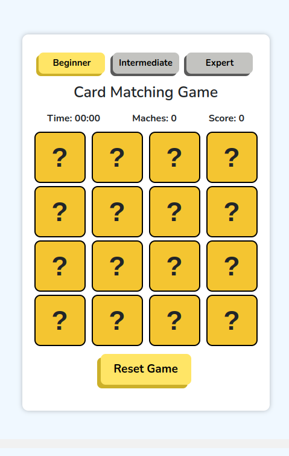
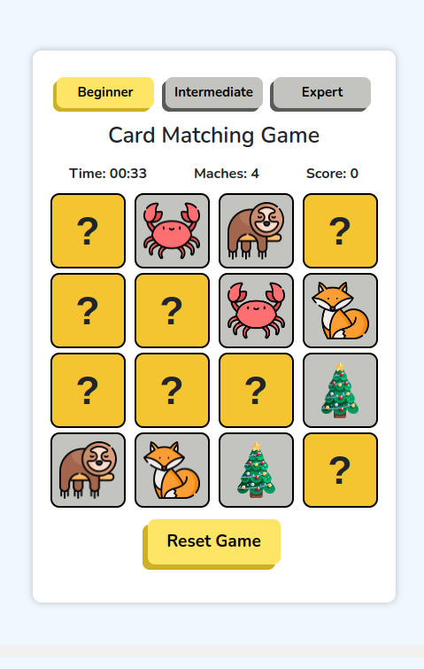

# Flip Card Memory Game
==========================

## Game Overview
---------------

The Flip Card Memory Game is a fun and challenging game that tests your memory and concentration. The game consists of a grid of cards with different pictures on them. The objective of the game is to consecutively tap on the same pictures, which can be located in different positions on the screen.

## How to Play
--------------

1. The game starts with a grid of cards facing down.
2. Tap on a card to flip it over and reveal the picture.
3. Try to find the matching picture by tapping on another card.
4. If the pictures match, the cards will remain face up.
5. If the pictures don't match, the cards will flip back over.
6. Continue tapping on cards to find all the matching pairs.

## Features
------------

* Grid size can be adjusted to suit different skill levels
* High score tracking to challenge yourself or compete with friends
* Fun and colorful graphics to keep you engaged

## Sample Screenshots
---------------------

### Game Board

### Flipped Cards

## Getting Started
-------------------

1. Clone the repository: `[https://github.com/AnuragDahiwade/Flip_Card_Memory_Game.git]`
2. Run the index.html file

## Contributing
--------------

Contributions are welcome! If you'd like to help improve the game, please fork the repository and submit a pull request.
