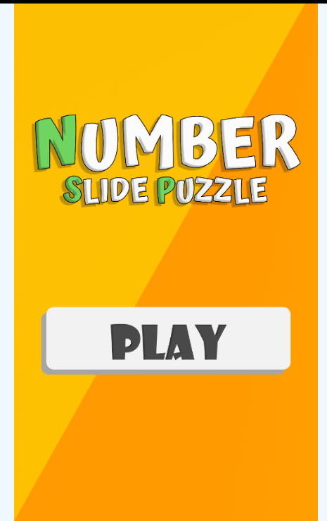
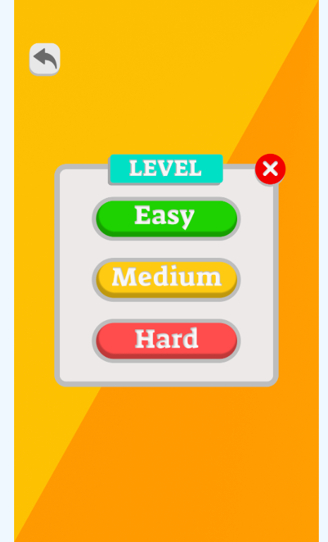
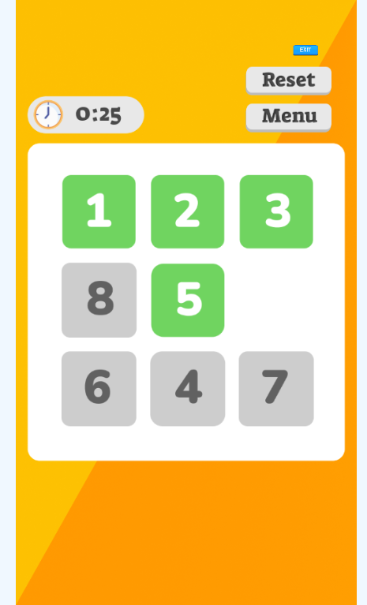
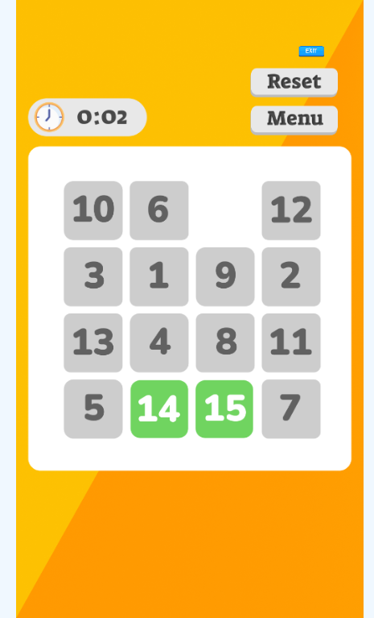
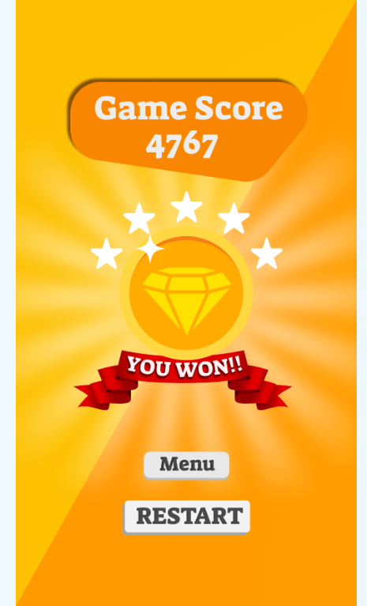

# Number Puzzle Game
=====================

## Game Overview
---------------

The Number Puzzle Game is a challenging and addictive puzzle game where you need to arrange numbers in a specific order to solve the puzzle. The game consists of a grid of numbers, and the objective is to move the numbers around to create a sequence of numbers in ascending order.

## How to Play
--------------

1. The game starts with a mixed-up grid of numbers.
2. Tap on a number to move it to an adjacent empty space.
3. Continue moving numbers until you create a sequence of numbers in ascending order (e.g., 1, 2, 3, ..., 9).
4. You can track your progress and score as you play.

## Features
------------

* Adjustable grid size to suit different skill levels
* High score tracking to challenge yourself or compete with friends
* Increasing difficulty levels as you progress through the game
* Simple yet challenging gameplay that's fun for all ages

## Screenshots
-------------

### Game Images

### Winning Screen

## Technical Details
-------------------

* Built using [insert technologies used, e.g., HTML, CSS, JavaScript and Phaser js]
* Compatible with desktop and mobile devices

## Contributing
------------

If you'd like to contribute to the game or report any issues, please feel free to submit a pull request or open an issue on this repository.

I hope this README.md file meets your expectations! Let me know if you need any further modifications.
