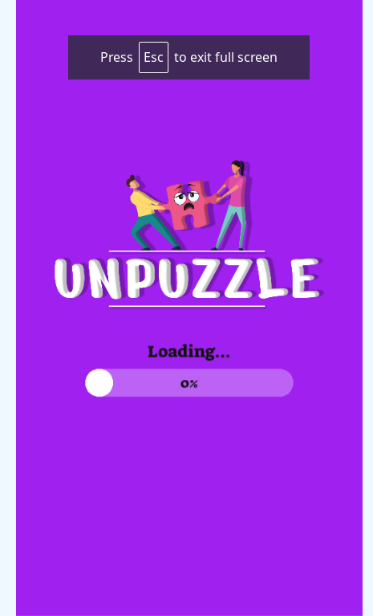
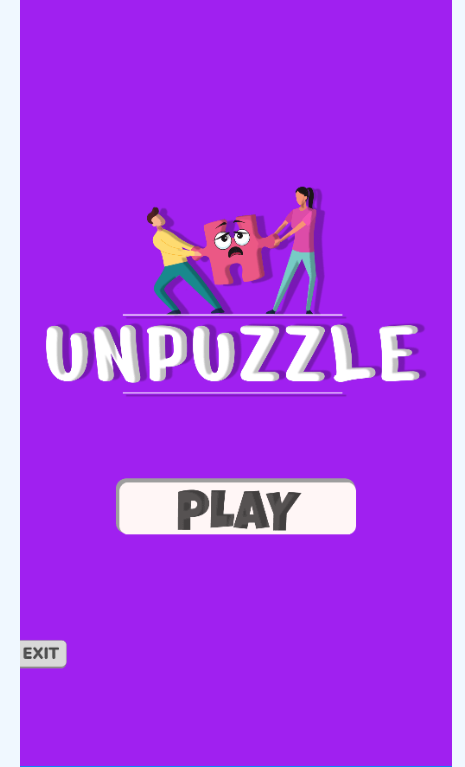
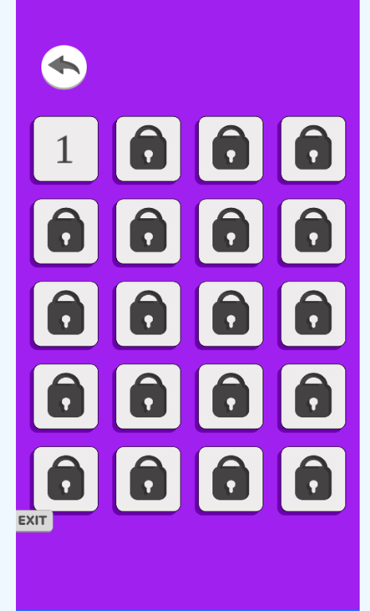
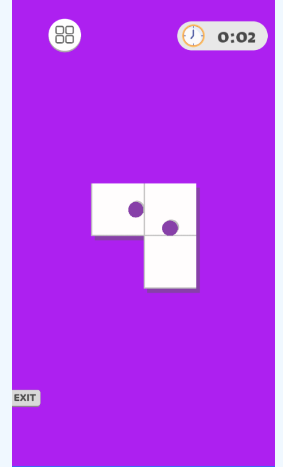
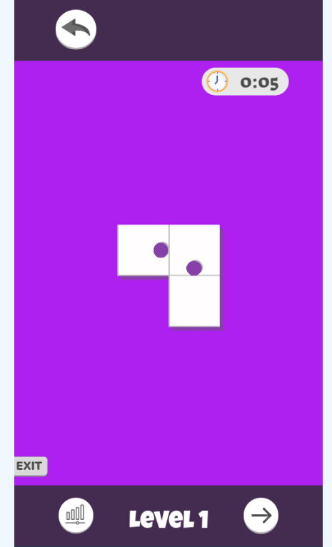
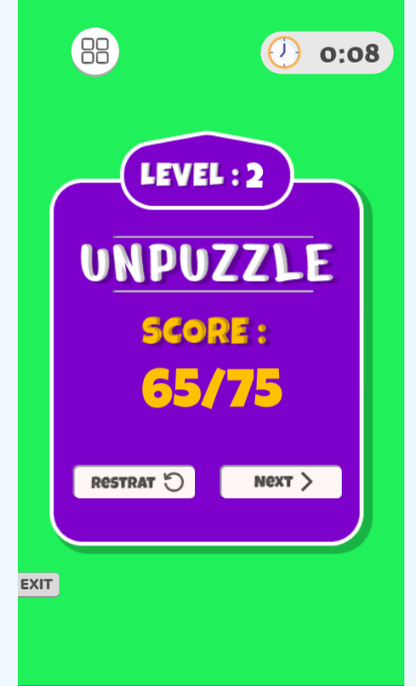

# Unpuzzle Game
=====================

## Game Overview
---------------

Technology : HTML5 , Phaser.js
Platform : Browser (desktop, mobile, tablet)

Unpuzzle game offers a unique twist on the classic Unpuzzle gameplay. Slide the pieces rather than removing them to solve intricate puzzles of varying difficulties. With its intuitive mechanics and challenging levels, Unpuzzle Slide provides an engaging experience for puzzle enthusiasts of all skill levels.

## How to Play
How to Play:

On Computer:

Click and drag a puzzle piece to slide it horizontally or vertically within the grid.
The objective is to create a path to slide each piece out of the puzzle area.
Consider the number on each piece, indicating the number of spaces it can slide.
Clear the puzzle area by strategically sliding pieces until all are removed.
On Mobile:

Tap and swipe a puzzle piece in the direction you want to slide it.
Take into account the number on each piece, determining its sliding range.
Strategically slide pieces to clear the puzzle area and progress to the next level.
Tips and Tricks:

Start by moving pieces with higher sliding ranges to create space within the puzzle.
Plan your moves strategically, considering the sliding limitations of each piece.
Experiment with different sequences of moves to optimize your solving strategy.
Utilize undo options if you make a mistake or need to backtrack to find the optimal solution.

## Features
------------

* Adjustable grid size to suit different skill levels
* High score tracking to challenge yourself or compete with friends
* Increasing difficulty levels as you progress through the game
* Simple yet challenging gameplay that's fun for all ages

## Screenshots
-------------

### Loading Screen

### Title Screen

### Levels Screen

### Game Screen

### High Score Screen

## Contributing
------------

If you'd like to contribute to the game or report any issues, please feel free to submit a pull request or open an issue on this repository.

